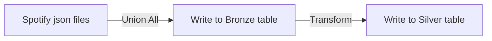

# 🎧 Spotify Data Monitor & Analytics

- 🔁 Last Update: 22/02/2026
- 📈 Progress: Completed
- 🚀 Deploy: [Dashboard](https://app.fabric.microsoft.com/view?r=eyJrIjoiZTRiMDYxMTktZGYwMC00MzAyLWI5MWQtN2JhYmExY2RmOWVlIiwidCI6IjY3YmE4MGMxLTAzZTUtNDhkMi1hZTIwLWRiZWJiNzNjNWUyNyJ9)

## 📋 Summary

- [📖 About project](#about-project)
- [🏗️ Architecture](#architecture)
- [🛠️ Technologies used](#technologies-used)
- [📋 Requirements](#requirements)
- [🚀 How to run](#how-to-run)
- [👨‍💻 Authors](#authors)

## 📖 About Project 

The project is a dashboard with data from my Spotify account ( Replicate with your information and see the magic ). Here you see how many songs you listened to, your top artists, how many minutes you listened to music, and much more. 

## 🏗️ Achitecture 

## 🛠️ Technologies used 

- Python 
    - Spark
    - Pandas
- Power BI

## 📋 Requirements 

- Data from your Spotify account and extended history of your Spotify account
- Databricks 
- PowerBI

## 🚀 How to run 

- Request your Spotify data [here](https://www.spotify.com/account/privacy/)
- Download your Spotify data
- Clone the project in Databricks
- Upload the files in separate folder in Volumes
    - If you not know how upload files, follow the steps:
        - In the sidebar, click the Workspace icon
        - Navigate to the directory where you want to create the new folder.
        - Right-click on the parent folder's name or the main workspace area, and select Create > Folder.
        - Enter a name for the new folder in the dialog box and press Enter or click outside the field to save it.
- copy the path of uploaded files
- Open the `notebooks/00-setup` file
- Find "REPLACE WITH YOUR OWN PATH" Use `ctrl + f` or `cmd + f`
- Replace to your path
- Run the `01-Extration` and `02-Transform` files
- Open the PowerBI
- Open the dashboard file
- In the initial page, click on down arrow below "Transform data"
- Select "Edit parameters"
- Put your Host and Path 
    - This information is in the final output of the `main` file in databricks
- Click "Apply changes"

## 👨‍💻 Author 

### [Matheus Rodrigues](https://www.linkedin.com/in/matheus-rodrigues-mrj/)